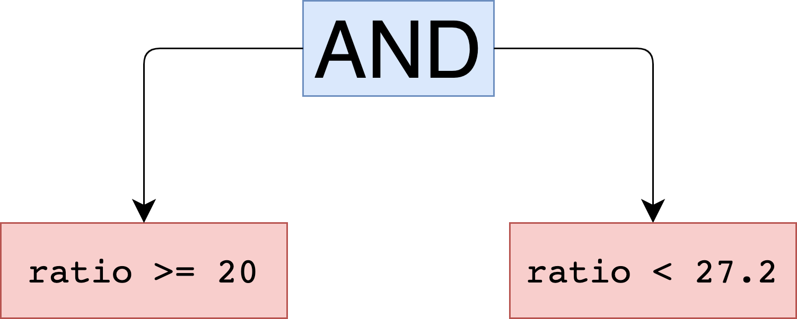

# Super Selector

## Universal Expression Builder from SQL-like Query Text
The interpreter parses the given query string and produces an object that
defines rules of filtering and selection. It can be used as an adapter
for various databases and data keepers. 

## Table of Contents
* [Quick Start](#quick-start)
* [Status](#status)
* [Basic Usage](#basic-usage)
* [Complex Queries](#complex-queries)
* [Detailed Documentation](#detailed-documentation)
    * [Grammar](#grammar)
    * [Logical Operators](#logical-operators)
    * [Data Types](#data-types)
    * [Keywords](#keywords)
    * [Equation Operators](#equation-operators)
        * [Comparing Operators](#comparing-operators)
        * [Inclusion Operators](#inclusion-operators)
        * [Range Operators](#range-operators)
        * [Equivalency Operators](#equivalency-operators)
* [Real Data Example](#real-data-example)

## Quick Start
Maven:
```xml
<dependency>
    <groupId>com.kirekov</groupId>
    <artifactId>super-selector</artifactId>
</dependency>
```

Gradle:
```groovy
implementation 'com.kirekov:super-selector'
```

## Status
[](https://travis-ci.com/SimonHarmonicMinor/super-selector)
[](https://sonarcloud.io/dashboard?id=SimonHarmonicMinor_super-selector)
[](https://sonarcloud.io/dashboard?id=SimonHarmonicMinor_super-selector)

## Basic Usage
Here is the simple approach.

```sql
age >= 22 && isMarried && name in ('Michael', 'Rebbecca', 'Bruce') || job != 'Software Engineer'
```

The interpreter returns the `ParsedQuery` that contains an `Expression`. It is based on the [Composite pattern](https://refactoring.guru/design-patterns/composite).
Each node might be either a concrete equation or a complex one. The given example will produce this hierarchy.


As you can see, AND operator (`&&`) has a higher priority than OR operator (`||`). But we can change it with brackets.
*****
```sql
age >= 22 && isMarried && (name in ('Michael', 'Rebbecca', 'Bruce') || job != 'Software Engineer')
```


## Complex Queries
Let's have a look on the `ParsedQuery` definition.

```kotlin
interface ParsedQuery {
    val expression: Expression
    val fields: List<String>
    val orderingRules: List<OrderingRule>
}
```

As a matter of fact, we can declare selecting fields and ordering rules as well.

```sql
SELECT name, age
WHERE age >= 22 
      && isMarried 
      && (name in ('Michael', 'Rebbecca', 'Bruce') || job != 'Software Engineer')
ORDER by name
ORDER by age DESC
```

I think you've noticed that the query is very similar to `SQL` but it does contain `FROM` clause.
All keywords are case-insensitive. So, it can be rewritten in this way.

```sql
select name, age
where age >= 22 
      && isMarried 
      && (name in ('Michael', 'Rebbecca', 'Bruce') || job != 'Software Engineer')
order by name
order by age desc
```


## Detailed Documentation
### Grammar
```
<Prog>          ::= <Select> <Where> <Orders> | <Select> <Orders> | <Select> | <OrExpression>
<Select>        ::= select * | select <Fields>
<Fields>        ::= <field> [, <Fields>]
<Where>         ::= where <OrExpression>
<OrExpression>  ::= <AndExpression> [|| <AndExpression>]
<AndExpression> ::= <Equation> [&& <Equation>]
<Equation>      ::= [!]<field> <operator> <value> | [!](<OrExpression>)
<Orders>        ::= <Order> [<Orders>]
<Order>         ::= order by <field> [asc | desc]
```

### Logical Operators

| Type   | Operator | Description                                               |
|--------|----------|-----------------------------------------------------------|
| Binary | `&&`     | AND operator. Returns true if all children are truthy.     |
| Binary | <code>&#124;&#124;</code>   | OR operator. Returns true if any child is truthy.          |
| Unary  | `!`      | DENIAL operator. Returns the vice-versa value of the node. |

### Data Types

| Type      | Example                                                | Description                                                                                                                                                 |
|-----------|--------------------------------------------------------|-------------------------------------------------------------------------------------------------------------------------------------------------------------|
| `String`  | `"My awesome string"`,<br>`'And another one'`              | Just a simple string value. It can be declared either with `"` or `'` symbols.                                                                              |
| `Decimal` | `1233123`,<br>`-82908756`,<br>`0`                              | The bounds of `Decimal` number are -2<sup>63</sup> ≤ x ≤ 2<sup>63 - 1</sup>.                                                                                |
| `Double`  | `-12.12`,<br>`0.0034`,<br>`88913.9823`                         | The floating-point number with double precision (up to 15 digits after the dot). The bounds approximately are -10<sup>308</sup> ≤ x ≤ 10<sup>308</sup>.     |
| `Date`    | `@12.05.2018@`,<br>`@12.05.2018 08:32@`,<br>`@12.05.2018 08:32:12@`,<br>`@12.05.2018 08:32 +12:30@` ,<br>`@12.05.2018 08:32:12 +12:30@` | The date has to be wrapped with `@` symbol and formatted with one of the several patterns:<br>`DD.MM.YYYY`<br>`DD.MM.YYYY HH:mm`<br>`DD.MM.YYYY HH:mm:ss`<br>`DD.MM.YYYY HH:mm ±HH:mm`<br>`DD.MM.YYYY HH:mm:ss ±HH:mm`<br>The time with the time zone (`±HH:mm`) resolves to `ZonedDateTime`. The other one to `LocalDateTime` |
| `Boolean` | `true`,<br>`false`                                         | Boolean values.                                                                                                                          |
| `Null`    | `null`                                                 | A special `null` value.                                                                                                                                     |

### Keywords
`select`, `where`, `order`, `by`, `asc`, `desc`, `null`, `true`, `false`, `not`, `in`, `is`.

If you need to use a keyword as a field name you should wrap it with backticks –  ``    `order`    ``, ``    `select`    ``, ``    `where`    `` etc.

### Equation Operators
#### Comparing Operators
`<=`, `<`, `=`, `!=`, `>`, `>=`

Can be used with `String`, `Decimal`, `Double`, and `Date` types.

Valid queries:
```sql
age > 19
creationDate = @21.10.2010 00:00:12@
somStrField <= 'myStr'
```
**Invalid** queries:
```sql
age > true
creationDate = null
someStrField >= false
```

#### Inclusion Operators
`in`, `not in`.

Can be used with any data types.

Valid queries:
```sql
age in (19, 20, 28, null)
name in ('Simon', 'Michael')
```

**Invalid** queries:
```sql
creationDate in ()
```

#### Range operators
The range equation has the following grammar rule
```
<RangeEquation>     ::= <field> in <Range> | <field> not in <Range>
<Range>             ::= <LeftBorder> <ComparableValue> .. <ComparableValue> <RightBorder>
<LeftBorder>        ::= ( | [
<RightBorder>       ::= ) | ]
<ComparableValue>   ::= <String> | <Decimal> | <Double> | <Date>
```

So, ranges can be build from any types that are acceptable for [Comparing Operators](#comparing-operators).
A round bracket means *exclusively* and square one *inclusively*.
The range values should be of one type (`Decimal` and `Double` are considered as one in this case)

Valid queries:
```sql
ratio in [20 .. 27.2)
name in ['Ah' .. 'Sy']
creationDate not in (@21.10.2010 12:12:00@ .. @12.02.2011 00:00:00@]
```

**Invalid** queries:
```sql
name in ['Ah', null)
age in ['18', 21]
```

**NB!**

Any range equation converts to the equivalent AND expression. 
For example, `ratio` comparing that is described above turns into this expression.


In the same way, the interpreter does not check whether the described range actually exists.
It means that the next equation is considered as valid.
```sql
ratio in (27.2 .. 20]
```

#### Equivalency Operators
`is`, `is not`.

Can be applied to `null` and `Boolean` values.

Valid queries:
```sql
creationDate is not null
isCorrupted is true
```

**Invalid** queries:
```sql
creationDate is not @21.10.2010 00:00:00@
age is 22
```

If we have an equivalency with `Boolean` values, an equation can be simplified
```sql
isCorrupted  => isCorrupted is true
!isCorrupted => !(isCorrupted is true)
```

## Real Data Example

Suppose we have such data records.

| # | age | sex    | name      | surname | job         |
|---|-----|--------|-----------|---------|-------------|
| 1 | 23  | Male   | Simon     | Kirekov | Programmer  |
| 2 | 35  | Male   | Michael   | Johnson | Driver      |
| 3 | 56  | Female | Catherine | Rails   | Nurse       |
| 4 | 47  | Male   | Jonathan  | Grey    | Programmer  |
| 5 | 43  | Male   | Henry     | Stevens | Gardener    |
| 6 | 24  | Female | Sara      | Parker  | QA-Engineer |
| 7 | 22  | Male   | Robert    | Purple  | Driver      |
| 8 | 23  | Female | Helen     | Carter  | Nurse       |

Let's build some queries.

* It requires to fetch all males older than 30 years but younger than 45 years. 
We are interested only at `age`, `sex`, and `surname` fields. The result must be sorted by `age` in descending order.

```sql
select age, sex, surname
where age in (30 .. 45) && sex = 'Male'
order by age desc
```

| # | age | sex  | surname |
|---|-----|------|---------|
| 1 | 47  | Male | Grey    |
| 2 | 43  | Male | Stevens |
| 3 | 35  | Male | Johnson |

*****

* It requires to find all nurses and drivers. 
Nurses must not be younger than 30 years and drivers must not be older than 25.
We need `age`, `name`, `surname`, and `job` fields. The result must be sorted by `name` and then by `surname` in ascending order.

```sql
select age, name, surname, job
where job = 'Nurse' && age >= 30 || job = 'Driver' && age <= 25
order by name 
order by surname
```

| # | age | name      | surname | job    |
|---|-----|-----------|---------|--------|
| 1 | 56  | Catherine | Rails   | Nurse  |
| 2 | 43  | Robert    | Purple  | Driver |