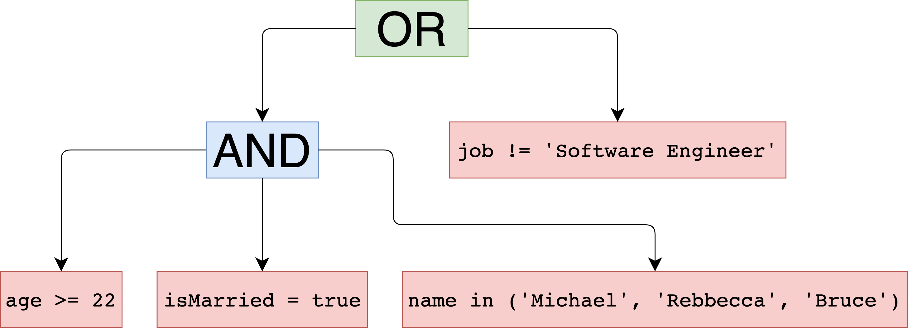
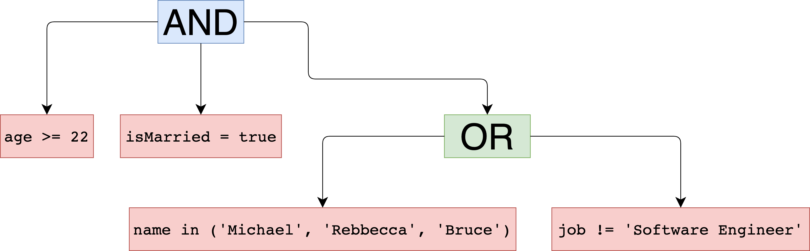

# Super Selector

## Universal Expression Builder from SQL-like Query Text
The interpreter parses the given query string and produces an object that
defines rules of filtering and selection. It can be used as an adapter
for various databases and data keepers. 

## Table of Contents
* [Quick Start](#quick-start)
* [Status](#status)
* [Basic Usage](#basic-usage)
* [Complex Queries](#complex-queries)
* [Detailed Documentation](#detailed-documentation)
    * [Grammar](#grammar)
    * [Logical Operators](#logical-operators)
    * [Data Types](#data-types)
    * [Keywords](#keywords)
    * [Equation Operators](#equation-operators)
        * [Comparing Operators](#comparing-operators)

## Quick Start
Maven:
```xml
<dependency>
    <groupId>com.github.simonharmonicminor</groupId>
    <artifactId>super-selector</artifactId>
</dependency>
```

Gradle:
```groovy
implementation 'com.github.simonharmonicminor:super-selector'
```

## Status
[](https://travis-ci.com/SimonHarmonicMinor/super-selector)
[](https://sonarcloud.io/dashboard?id=SimonHarmonicMinor_super-selector)
[](https://sonarcloud.io/dashboard?id=SimonHarmonicMinor_super-selector)

## Basic Usage
Here is the simple approach.

```sql
age >= 22 && isMarried && name in ('Michael', 'Rebbecca', 'Bruce') || job != 'Software Engineer'
```

The interpreter returns the `ParsedQuery` that contains an `Expression`. It is based on the [Composite pattern](https://refactoring.guru/design-patterns/composite).
Each node might be either a concrete equation or a complex one. The given example will produce this hierarchy.



As you can see, AND operator (`&&`) has a higher priority than OR operator (`||`). But we can change it with brackets.
*****
```sql
age >= 22 && isMarried && (name in ('Michael', 'Rebbecca', 'Bruce') || job != 'Software Engineer')
```


## Complex Queries
Let's have a look on the `ParsedQuery` definition.

```kotlin
interface ParsedQuery {
    val expression: Expression
    val fields: List<String>
    val orderingRules: List<OrderingRule>
}
```

As a matter of fact, we can declare selecting fields and ordering rules as well.

```sql
SELECT name, age
WHERE age >= 22 
      && isMarried 
      && (name in ('Michael', 'Rebbecca', 'Bruce') || job != 'Software Engineer')
ORDER by name
ORDER by age DESC
```

I think you've noticed that the query is very similar to `SQL` but it does contain `FROM` clause.
All keywords are case-insensitive. So, it can be rewritten in this way.

```sql
select name, age
where age >= 22 
      && isMarried 
      && (name in ('Michael', 'Rebbecca', 'Bruce') || job != 'Software Engineer')
order by name
order by age desc
```


## Detailed Documentation
### Grammar
```
<Prog>          ::= <Select> <Where> <Orders> | <Select> <Orders> | <Select> | <OrExpression>
<Select>        ::= select * | select <Fields>
<Fields>        ::= <field> [, <Fields>]
<Where>         ::= where <OrExpression>
<OrExpression>  ::= <AndExpression> [|| <AndExpression>]
<AndExpression> ::= <Equation> [&& <Equation>]
<Equation>      ::= [!]<field> <operator> <value> | [!](<OrExpression>)
<Orders>        ::= <Order> [<Orders>]
<Order>         ::= order by <field> [asc | desc]
```

### Logical Operators

| Type   | Operator | Description                                               |
|--------|----------|-----------------------------------------------------------|
| Binary | `&&`     | AND operator. Returns true if all children are truthy.     |
| Binary | <code>&#124;&#124;</code>   | OR operator. Returns true if any child is truthy.          |
| Unary  | `!`      | DENIAL operator. Returns the vice-versa value of the node. |

### Data Types

| Type      | Example                                                | Description                                                                                                                                                 |
|-----------|--------------------------------------------------------|-------------------------------------------------------------------------------------------------------------------------------------------------------------|
| `String`  | `"My awesome string"`,<br>`'And another one'`              | Just a simple string value. It can be declared either with `"` or `'` symbols.                                                                              |
| `Decimal` | `1233123`,<br>`-82908756`,<br>`0`                              | The bounds of `Decimal` number are -2<sup>63</sup> ≤ x ≤ 2<sup>63 - 1</sup>.                                                                                |
| `Double`  | `-12.12`,<br>`0.0034`,<br>`88913.9823`                         | The floating-point number with double precision (up to 15 digits after the dot). The bounds approximately are -10<sup>308</sup> ≤ x ≤ 10<sup>308</sup>.     |
| `Date`    | `@12.05.2018 08:32:12@`,<br>`@12.05.2018 08:32:12 +12:30@` | The date has to be wrapped with `@` symbol and formatted with pattern `DD.MM.YYYY HH:mm:SS`. Also, it is possible to pass the time zone in format `±HH:mm`. The date without the time zone converts to `LocalDateTime` while time zoned to `ZonedDateTime`. |
| `Boolean` | `true`,<br>`false`                                         | Boolean values.                                                                                                                          |
| `Null`    | `null`                                                 | A special `null` value.                                                                                                                                     |

### Keywords
`select`, `where`, `order`, `by`, `asc`, `desc`, `null`, `true`, `false`, `not`, `in`, `is`

If you need to use a keyword as a field name you should wrap it with backticks –  ``    `order`    ``, ``    `select`    ``, ``    `where`    `` etc.

### Equation Operators
#### Comparing Operators